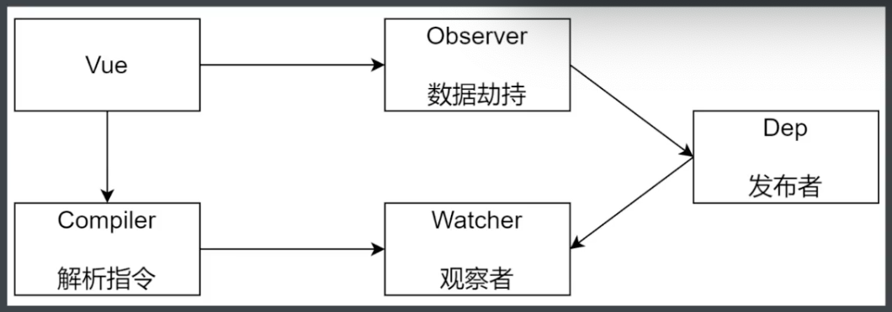
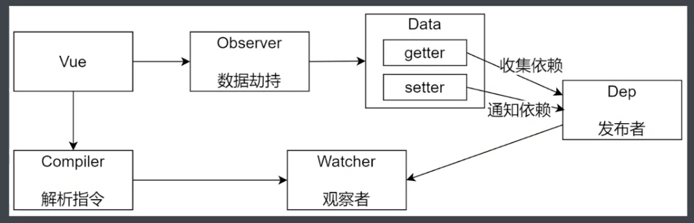
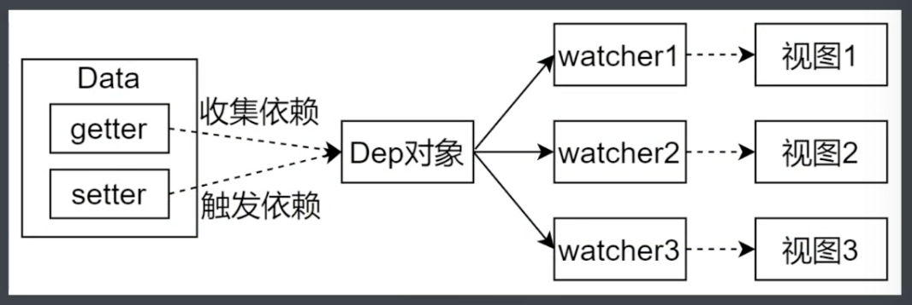
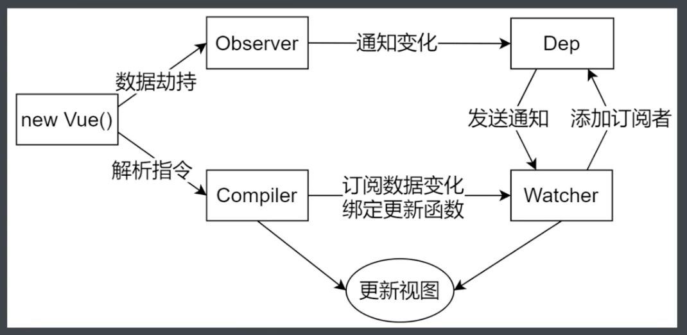

### Vue 响应式原理模拟

---

#### 数据驱动

- 数据响应式
  - 数据模型仅仅是普通的 JavaScript 对象，修改数据时，视图会进行更新，避免了繁琐的 DOM 操作，提高开发效率
- 双向绑定
  - 数据改变，视图改变；视图改变，数据也随之改变
  - 可以使用 v-model 在表单元素上创建双向数据绑定
- 数据驱动
  - 开发过程中仅需要关注数据本身，不需要关心数据是如何渲染到视图


#### 数据响应式核心原理

Vue 2.x

- [Vue 2.x 深入响应式原理](https://cn.vuejs.org/v2/guide/reactivity.html)
- MDN - Object.defineProperty
- 浏览器兼容 IE8 以上（不兼容 IE8）

```js
// 模拟 Vue 中的 data 选项
let data = {
  msg: 'hello'
}

// 模拟 Vue 的实例
let vm = {}

// 数据劫持：当访问或者设置 vm 中的成员的时候，做一些干预操作
Object.defineProperty(vm, 'msg', {
  // 可枚举（可遍历）
  enumerable: true,
  // 可配置（可以使用 delete 删除，可以通过 defineProperty 重新定义）
  configurable: true,
  // 当获取值的时候执行
  get () {
    console.log('get: ', data.msg)
    return data.msg
  },
  // 当设置值的时候执行
  set (newValue) {
    console.log('set: ', newValue)
    if (newValue === data.msg) {
      return
    }
    data.msg = newValue
  }
})

// 测试
vm.msg = 'Hello, World'
console.log(vm.msg)
```

> 如果一个对象中多个属性需要转换 getter/setter 如何处理

Vue 3.x

- MDN - Proxy
- 直接监听对象，而非属性
- ES6 中新增，IE 不支持，性能有浏览器优化

对属性遍历，依次使用 Object.defineProperty

```js
// 模拟 Vue 中的 data 选项
let data = {
	msg: 'hello',
  count: 10
}

// 模拟 Vue 的实例
let vm = {}

proxyData(data)

function proxyData(data) {
  // 遍历 data 对象的所有属性
  Object.keys(data).forEach(key => {
    // 把 data 中的属性，转换成 vm 的 getter/setter
    Object.defineProperty(vm, key, {
      enumerable: true,
      configurable: true,
      get () {
        console.log('get: ', key, data[key])
        return data[key]
      },
      set (newValue) {
        console.log('set: ', key, newValue)
        if (newValue === data[key]) {
          return
        }
        data[key] = newValue
      }
    })
  })
}

// 测试
vm.msg = 'Hello, World'
console.log(vm.msg)
```

直接使用 Proxy

```js
// 模拟 Vue 中的 data 选项
let data = {
  msg: 'hello',
  count: 0
}

// 模拟 Vue 实例
let vm = new Proxy(data, {
  // 执行代理行为的函数
  // 当访问 vm 的成员会执行
  get (target, key) {
    console.log('get, key: ', key, target[key])
    return target[key]
  },
  // 当设置 vm 的成员会执行
  set (target, key, newValue) {
    console.log('set, key: ', key, newValue)
    if (target[key] === newValue) {
      return
    }
    target[key] = newValue
  }
})

// 测试
vm.msg = 'Hello, World'
console.log(vm.msg)
```


#### 发布/订阅模式

- 订阅者

- 发布者

- 信号中心

  > 假定，存在一个“信号中心”，某个任务执行完成，就向信号中心“发布”（publish）一个信号，其他任务可以向信号中心“订阅”（subscribe）这个信号，从而知道什么时候自己可以开始执行，这就叫做“发布/订阅模式”（publish-subscribe pattern）

- Vue 的自定义事件 [https://cn.vuejs.org/v2/guide/migration.html#dispatch-%E5%92%8C-broadcast-%E6%9B%BF%E6%8D%A2](https://cn.vuejs.org/v2/guide/migration.html#dispatch-和-broadcast-替换)

  ```js
  let vm = new Vue()
  
  vm.$on('dataChange', () => {
    console.log('dataChange')
  })
  
  vm.$on('dataChange', () => {
    console.log('dataChange1')
  })
  
  vm.$emit('dataChange')
  ```

  

- 兄弟组件通信过程

  ```js
  // eventBus.js
  // 事件中心
  let eventHub = new Vue()
  
  // ComponentA.vue
  // 发布者
  addTodo: function () {
    // 发布消息（事件）
    eventHub.$emit('add-todo', { text: this.newTodoText })
    this.newTodoText = ''
  }
  
  // ComponentB.vue
  // 订阅者
  created: function () {
    // 订阅消息（事件）
    eventHub.$on('add-todo', this.addTodo)
  }
  ```

  

- 模拟 Vue 自定义事件的实现

  ```js
  // 事件触发器
  class EventEmitter {
    constructor () {
      // { 'click': [fn1, fn2], 'change': [fn] }
      this.subs = Object.create(null)
    }
    
    // 注册事件
    $on (eventType, handler) {
      this.subs[eventType] = this.subs[eventType] || []
      this.subs[eventType].push(handler)
    }
    
    // 触发事件
    $emit (eventType) {
      if (this.subs[eventType]) {
        this.subs[eventType].forEach(handler => {
          handler()
        })
      }
    }
  }
  
  // 测试
  let em = new EventEmitter()
  em.$on('click', () => {
    console.log('click1')
  })
  em.$on('click', () => {
    console.log('click2')
  })
  
  em.$emit('click')
  ```

  

#### 观察者模式

- 观察者（订阅者）-- Watcher
  - update()：当事件发生时，具体要做的事情
- 目标（发布者）-- Dep
  - subs 数组：存储所有的观察者
  - addSub()：添加观察者
  - notify()：当事件发生，调用所有观察者的 update 方法
- 没有事件中心

```js
// 目标（发布者）
// Dependency
class Dep {
  constructor () {
    // 存储所有的观察者
    this.subs = []
  }
  // 添加观察者
  addSub (sub) {
    if (sub && sub.update) {
      this.subs.push(sub)
    }
  }
  // 通知所有观察者
  notify () {
    this.subs.forEach(sub => {
      sub.update()
    })
  }
}

// 观察者（订阅者）
class Watcher {
  update () {
    console.log('update')
  }
}

// 测试
let dep = new Dep()
let watcher = new Watcher()

dep.addSub(watcher)

dep.notify()
```

---

#### 两种模式小结

- 观察者模式是由具体目标调度，比如当事件触发，Dep 就会去调用观察者的方法，所以观察者模式的订阅者与发布者之间是存在依赖的
- 发布/订阅模式由统一调度中心调用，因此发布者和订阅者不需要知道对方的存在

---

#### 响应式原理整体分析

- Vue 基本结构
- 打印 Vue 实例观察
- 整体结构




##### 逐步实现

- Vue

  功能：

  - 负责接收初始化的参数（选项）
  - 负责把 data 中的属性注入到 Vue 实例，转换成 getter/setter
  - 负责调用 observer 监听 data 中所有属性的变化
  - 负责调用 compiler 解析指令/插值表达式

  结构

  | Vue                                       |
  | ----------------------------------------- |
  | + `$options` <br />+ `$el`<br />+ `$data` |
  | - _proxyData()                            |

  代码

  ```js
  class Vue {
    constructor (options) {
      // 1. 通过属性保存选项的数据
      this.$options = options || {}
      this.$data = options.data || {}
      this.$el = typeof options.el === 'string' ? document.querySelector(options.el) : options.el
      // 2. 把 data 中的成员转换成 getter/setter，注入到 vue 实例中
      this._proxyData(this.$data)
      // 3. 调用 observer 对象，监听数据的变化
      new Observer(this.$data)
      // 4. 调用 compiler 对象，解析指令和插值表达式
      new Compiler(this)
    }
    
    _proxyData (data) {
      // 遍历 data 中的所有属性
      Object.keys(data).forEach(key => {
        // 把 data 的属性注入到 vue 实例中
        Object.defineProperty(this, key, {
          enumerable: true,
          configurable: true,
          get () {
            return data[key]
          },
          set (newValue) {
            if (newValue === data[key]) {
              return
            }
            data[key] = newValue
          }
        })
      })
    }
  }
  ```

  

  

- Observer

  功能

  - 负责把 data 选项中的属性转换成响应式数据
  - data 中的某个属性也是对象，把该属性转换成响应式数据
  - 数据变化发送通知

  结构

  | Observer                                             |
  | ---------------------------------------------------- |
  | + walk(data)<br />+ defineReactive(data, key, value) |

  

  代码

  ```js
  // 负责数据劫持
  // 把 $data 中的成员转换成 getter/setter
  class Observer {
    constructor (data) {
      this.walk(data)
    }
    walk (data) {
      // 1. 判断 data 是否是对象
      if (data || typeof data !== 'object') {
        return
      }
      // 2. 遍历 data 对象的所有属性
      Object.keys(data).forEach(key => {
        this.defineReactive(data, key, data[key])
      })
    }
    defineReactive (obj, key, val) {
      let that = this
      // 负责收集依赖，并发送通知
      let dep = new Dep()
      // 如果 val 是对象，把 val 内部的属性转换成响应式数据
      this.walk(val)
      Object.defineProperty(obj, key, {
        enumerable: true,
        configurable: true,
        get () {
          // 收集依赖
          Dep.target && dep.addSub(Dep.target)
          return val // 此处不能使用 obj[key]，不然会发生死递归
        },
        set (newValue) {
          if (newValue === val) {
            return
          }
          val = newValue
          that.walk(newValue)
          // 发送通知
          dep.notify()
        }
      })
    }
  }
  ```

  

- Compiler

  功能

  - 负责编译模板，解析指令/插值表达式
  - 负责页面的首次渲染
  - 当数据变化后重新渲染视图

  结构

  | Compiler                                                     |
  | ------------------------------------------------------------ |
  | + el<br />+ vm                                               |
  | + compile(el)<br />+ compileElement(node)<br />+ compileText(node)<br />+ isDirective(attrName)<br />+ isTextNode(node)<br />+ isElementNode(node) |

  代码

  ```js
  class Compiler {
    constructor (vm) {
      this.el = vm.$el
      this.vm = vm
      this.compile(this.el)
    }
    // 编译模板，处理文本节点和元素节点
    compile (el) {
      let childNodes = el.childNodes
      // 遍历 el 中的所有子节点
      Array.from(childNodes).forEach(node => {
        // 处理文本节点
        if (this.isTextNode(node)) {
          this.compileText(node)
        } else {
          // 处理元素节点
          this.compileElement(node)
        }
        
        // 判断 node 节点，是否有子节点，如果有子节点，要递归调用 compile
        if (node.childNodes && node.childNodes.length) {
          this.compile(node)
        }
      })
    }
    // 编译元素节点，处理指令
    compileElement (node) {
      // 遍历所有的属性节点
      Array.from(node.attributes).forEach(attr => {
        // 判断是否是指令
      	let attrName = attr.name
        if (this.isDirective(attrName)) {
          // v-text --> text 
          // v-model --> model
          attrName = attrName.substr(2)
          // v-text = msg，此处获取 msg 的字符名
          let key = attr.value
          this.update(node, key, attrName)
        }
      })
    }
    // 处理指令相关的功能
    update (node, key, attrName) {
      let updateFn = this[attrName + 'Updater']
      // 确保 updateFn 内的 update 方法 this 指向 compiler 类
      updateFn && updateFn.call(this, node, this.vm[key], key)
    }
    // 处理 v-text 指令
    textUpdater (node, value, key) {
      node.textContent = value
      new Watcher(this.vm, key, (newValue) => {
        node.textContent = newValue
      })
    }
    // 处理 v-model 指令
    modelUpdater (node, value, key) {
      node.value = value
      new Watcher(this.vm, key, (newValue) => {
        node.value = newValue
      })
      // 双向绑定
      node.addEventListener('input', () => {
        this.vm[key] = node.value
      })
    }
    // 编译文本节点，处理差值表达式
    compileText (node) {
      // {{ msg }}
      let reg = /\{\{(.+?)\}\}/
      let value = node.textContent
      if (reg.test(value)) {
        // 获取 msg 的字符名
        let key = RegExp.$1.trim()
        node.textContent = value.replace(reg, this.vm[key])
        
        // 创建 watcher 对象，当数据改变更新视图
        new Watcher(this.vm, key, (newValue) => {
          node.textContent = newValue
        })
      }
    }
    // 判断元素属性是否是指令
    isDirective (attrName) {
      return attrName.startsWith('v-')
    }
    // 判断节点是否是文本节点
    isTextNode (node) {
      return node.nodeType === 3
    }
    // 判断节点是否是元素节点
    isElementNode (node) {
      return node.nodeType === 1
    }
  }
  ```

  

- Dep(Dependency)

  

  功能

  - 收集依赖，添加观察者（watcher）
  - 通知所有观察者

  结构

  | Dep                           |
  | ----------------------------- |
  | + subs                        |
  | + addSub(sub)<br />+ notify() |

  代码

  ```js
  class Dep {
    constructor () {
      // 存储所有的观察者
      this.subs = []
    }
    // 添加观察者
    addSub (sub) {
      if (sub && sub.update) {
        this.subs.push(sub)
      }
    }
    // 发送通知
    notify () {
      this.subs.forEach(sub => {
        sub.update()
      })
    }
  }
  ```

  

- Watcher

  
  
  功能
  
  - 当数据变化触发依赖，dep 通知所有的 Watcher 实例更新视图
  - 自身实例化的时候往 dep 对象中添加自己
  
  结构
  
  | Watcher                                   |
  | ----------------------------------------- |
  | + vm<br />+ key<br />+ cb<br />+ oldValue |
  | + update()                                |
  
  代码
  
  ```js
  class Watcher {
    constructor (vm, key, cb) {
      this.vm = vm
      // data 中的属性名称
      this.key = key
      // 回调函数负责更新视图
      this.cb = cb
      
      // 把 watcher 对象记录到 Dep 类的静态属性 target
      Dep.target = this
      // 触发 get 方法，在 get 方法中会调用 addSub
  		// 访问属性时就会触发 get 方法
      this.oldValue = vm[key]
      // 访问属性完毕后，将 Dep.target 置空，防止重复添加
      Dep.target = null
    }
    // 当数据发生变化的时候更新视图
    update () {
      let newValue = this.vm[this.key]
      if (this.oldValue === newValue) {
        return
      }
      this.cb(newValue)
    }
  }
  ```
  
  使用
  
  - Compiler/compileText 中创建 watcher 对象
  - Compiler/compileElement/textUpdater+modelUpdater 中创建 watcher 对象


- 双向绑定

  现状：数据改变时，视图会更新；视图里文本框内容改变时，数据不会改变

  解决方法：在 Compiler/moduleUpdater 中设置双向绑定

  

##### 调试

1. 调试页面首次渲染的过程

2. 调试数据改变更新视图的过程

   断点设置在发送通知 Observer/dep.notify()

---

#### 总结

问题

- 给属性重新赋值成对象，对象中的成员是否是响应式的？是

- 给 Vue 实例新增一个成员是否是响应式的？

  ```js
  let vm = new Vue({
    el: '#app',
    data: {
      // xxx
    }
  })
  
  vm.test = 'abc'
  ```

  test 是非响应式的数据

  [对于已经创建的实例，Vue 不允许动态添加根级别的响应式属性。但是，可以使用 Vue.set(object, propertyName, value) 方法向嵌套对象添加响应式属性](https://cn.vuejs.org/v2/guide/reactivity.html#%E6%A3%80%E6%B5%8B%E5%8F%98%E5%8C%96%E7%9A%84%E6%B3%A8%E6%84%8F%E4%BA%8B%E9%A1%B9)

整体流程



