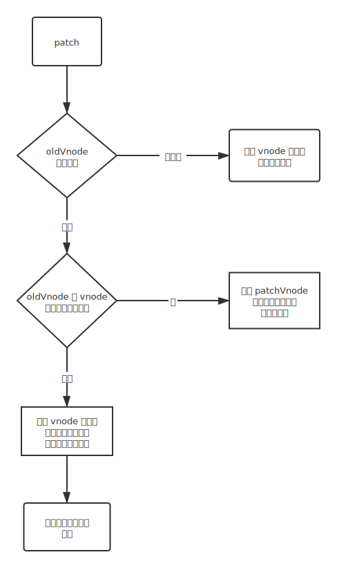
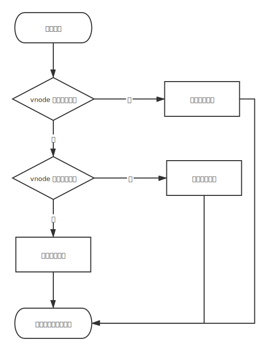
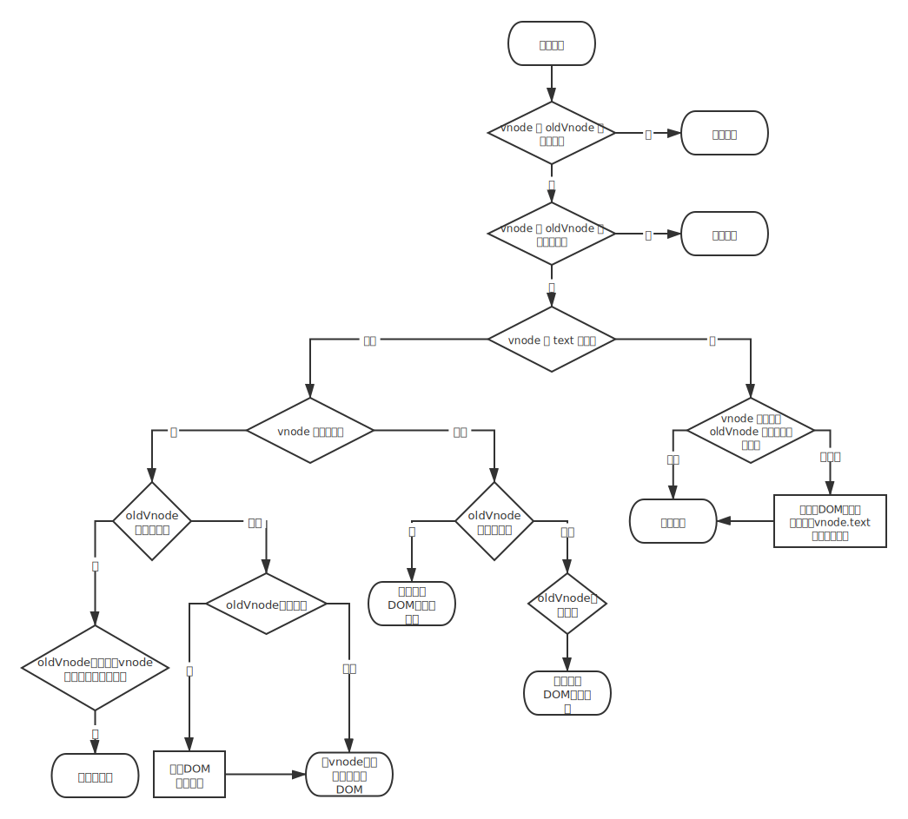
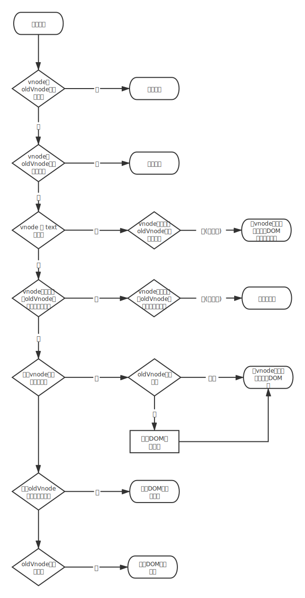

# patch

虚拟 DOM 最核心的部分—— patch，将 vnode 渲染成真实的 DOM

操作如下：

1. 比对新旧两个 vnode 之间有哪些不同
2. 根据比对结果找出需要更新的节点进行更新

如此操作的原因：

- DOM 操作的执行速度远不如 JavaScript 的运算速度快
- 把大量的 DOM 操作搬运到 JavaScript 中，使用 patching 算法计算出真正需要更新的节点，最大限度地减少 DOM 操作，从而显著提升性能

> **本质上是使用 JavaScript 的运算成本来替换 DOM 操作的执行成本**

---

## patch 介绍

比对两个 vnode 之间的差异是 patch 的手段；高效、快速的修改 DOM 节点才是 patch 的目的

对现有 DOM 进行修改需要做三件事

1. 创建新增的节点
2. 删除已经废弃的节点
3. 修改需要更新的节点

所以，patch 的过程其实就是创建节点、删除节点和修改节点的过程

- 什么情况下创建新节点，插入到什么位置
- 什么情况下删除节点，删除哪个节点
- 什么情况下修改节点，修改哪个节点

> **之所以需要通过算法来比对两个节点之间的差异，并针对不同的节点进行更新，主要是为了性能考虑**

如果不考虑性能，完全可以把整个旧节点从 DOM 删除，然后使用最新的状态（state）重新生成一份全新的节点并插入到 DOM 中

最终目的是**渲染视图**，渲染视图的标准是以 vnode（使用最新状态创建的 vnode）来渲染而不是 oldVnode（上一次渲染 DOM 所创建的 vnode），因此，当 oldVnode 和 vnode 不一样时，**以 vnode 为准来渲染视图**


### 新增节点

**只有那些因为状态的改变而新增的节点在 DOM 中并不存在是，我们才需要创建一个节点并插入到 DOM 中**

- 当 oldVnode 不存在而 vnode 存在时，就需要使用 vnode 生成真实的 DOM 元素并将其插入到视图中
- 当 vnode 和 oldVnode 完全不是同一个节点时（此时，vnode 是一个全新的节点，而 oldVnode 是一个被废弃的节点），以 vnode 为标准来渲染视图


### 删除节点

当一个节点只存在于 oldVnode 时，需要把它从 DOM 移除

- 当 oldVnode 和 vnode 完全不是同一个节点时，在 DOM 中需要使用 vnode 创建的新节点替换 oldVnode 所对应的旧节点——将新创建的 DOM 节点插入到旧节点的旁边，然后再将旧节点删除，完成替换过程


### 更新节点

新增节点和删除节点的场景，共同点是：两个虚拟节点是完全不同的。因此，执行的操作只有两个：将旧节点删除或创建新增节点

更常见的场景：新旧两个节点是同一个节点。需要对这两个节点进行比较细致的比对，然后对 oldVnode 在视图中所对应的真实节点进行更新


### 小结

- 当 oldVnode 不存在时，直接使用 vnode 渲染视图
- 当 oldVnode 和 vnode 都存在但不是同一个节点时，使用 vnode 创建的 DOM 元素替换旧的 DOM 元素
- 当 oldVnode 和 vnode 是同一个节点时，使用更详细的对比操作对真实的 DOM 节点进行更新




---

## 创建节点

创建一个真实的 DOM 元素所需的信息都保存在 vnode 中，而 vnode 是有类型的，因此需要根据 vnode 的类型来创建相同类型的 DOM 元素，将 DOM 元素插入到视图中

只有三种类型的节点会被创建并插入到 DOM 中：元素节点、注释节点、文本节点

- 如果一个 vnode 具有 tag 属性，就是元素节点，调用当前环境下的 createElement 方法创建真实的元素节点，调用当前环境下的 appendChild 方法将元素插入到指定的父节点中
  - 元素节点通常都会有子节点，当一个元素节点被创建后，需要将它的子节点也创建并插入到这个刚创建的节点下面：创建子节点的过程是一个递归过程，vnode 中的 children 属性保存了当前节点的所有子虚拟节点（child virtual node），将 vnode 中的 children 属性循环一遍，将每个子虚拟节点都执行一遍创建元素的逻辑
- 如果一个 vnode 具有 isComment 属性，就是注释节点，调用当前环境下的 createComment 方法创建真实的注释节点并将其插入到指定的父节点中
- 如果一个 vnode 既不存在 tag 属性，也不存在 isComment 属性，就是文本节点，调用当前环境下的 createTextNode 方法创建真实的文本节点并将其插入到指定的父节点中




## 删除节点

```js
function removeVnodes (vnodes, startIdx, endIdx) {
  for (; startIdx <= endIdx; ++startIdx) {
    const ch = vnodes[startIdx]
    if (isDef(ch)) {
      removeNode(ch.elm)
    }
  }
}
```

上述代码的功能：删除 vnodes 数组中从 startIdx 指定的位置到 endIdx 指定位置的内容

removeNode 用于删除视图中的单个节点，而 removeVnodes 用于删除一组指定的节点

```js
const nodeOps = {
  removeChild (node, child) {
    node.removeChild(child)
  }
}

function removeNode (el) {
  const parent = nodeOps.parentNode(el)
  if (isDef(parent)) {
    nodeOps.removeChild(parent, el)
  }
}
```

上述逻辑是将当前元素从它的父节点中删除，nodeOps 是对节点操作的封装

**为什么不直接使用 parent.removeChild(child) 删除节点，而是将这个节点操作封装成函数放在 nodeOps 里？**

>Vue.js 组件被设计可以跨平台渲染，跨平台渲染的本质是在设计框架的时候，要让框架的渲染机制和 DOM 解耦。只要把框架更新 DOM 时的节点操作进行封装，就可以实现跨平台渲染，在不同平台下调用节点的操作
>
>可以把各平台下节点操作的封装看成渲染引擎，将这些渲染引擎所提供的节点操作的 API 和框架的运行时对接一下，就可以实现将框架中的代码进行原生渲染的目的


## 更新节点

只有两个节点是同一个节点，才需要更新元素节点，通过比对找出新旧两个节点不一样的地方，针对那些不一样的地方进行更新


### 静态节点

更新节点时，首先需要判断新旧两个虚拟节点是否是静态节点，如果是，就不需要进行更新操作，直接跳过更新节点的过程

> 静态节点指的是那些一旦渲染到界面上之后，无论日后状态如何变化，都不会发生任何变化的节点

例如：

```html
<p>我是静态节点，我不需要发生变化</p>
```


### 新虚拟节点有文本属性

当新旧两个虚拟节点（vnode 和 oldVnode）不是静态节点，并且有不同的属性时，要以新虚拟节点（vnode）为准来更新视图

- 如果新虚拟节点（vnode）有 text 属性，不管之前旧节点的子节点是什么，直接调用 setTextContent 方法来将视图中 DOM 节点的内容改为虚拟节点（vnode）的 text 属性所保存的文字

- 如果之前的旧节点也是文本，并且和新节点的文本相同，就不需要执行 setTextContent 方法来重复设置相同的文本

**当新虚拟节点有文本属性，并且和旧虚拟节点的文本属性不一样时，可以直接把视图中的真实 DOM 节点的内容改成新虚拟节点的文本**


### 新虚拟节点无文本属性

如果新创建的虚拟节点（vnode）没有 text 属性，那它就是一个元素节点。

元素节点通常会有子节点，即 children 属性，也可能没有

- 有 children 的情况

  - 旧虚拟节点（oldVnode）也有 children 属性，需要对新旧两个虚拟节点的 children 进行一个更详细的对比并更新。更新 children 可能会移动某个子节点的位置，也有可能会删除或新增某个子节点，具体更新 children 的过程稍后分析
  - 旧虚拟节点（oldVnode）没有 children 属性，说明旧虚拟节点要么是一个空标签，要么是有文本的文本节点：
    - 如果是文本节点，先把文本清空让它变成空标签，让后将新虚拟节点（vnode）中的 children 挨个创建成真实的 DOM 元素节点并将其插入到视图中的 DOM 节点下面

- 无 children 的情况

  当新创建的虚拟节点（vnode）既没有 text 属性也没有 children 属性时，说明这个新创建的虚拟节点（vnode）是一个空节点，此时，如果旧虚拟节点（oldVnode）中有子节点就删除子节点，有文本就删除文本，有什么删什么，使得视图中是空标签


### 小结

更新节点的逻辑



源码中真实的实现过程




---


