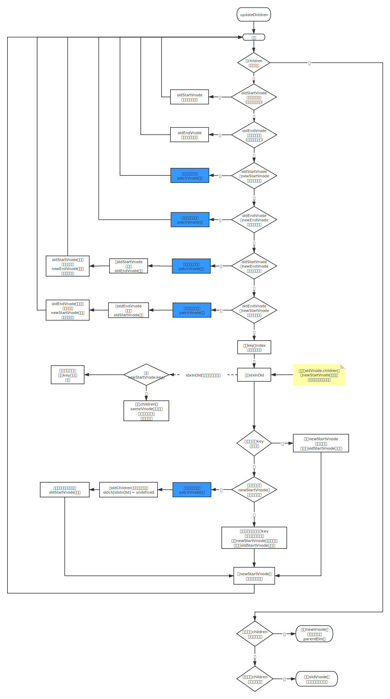

# 更新子节点

当新节点的子节点和旧节点的子节点都存在并且不相同时，会进行子节点的更新操作，大致分为4中操作：

- 更新节点
- 新增节点
- 删除节点
- 移动节点位置

因此，更新子节点更多的是讨论

- 什么情况下需要更新节点
- 什么情况下需要新增节点 等


对比两个子节点列表（children），首先需要做的是循环

1. 循环 newChildren（新子节点列表）
2. 每循环到一个新子节点，就去 oldChildren（旧子节点列表）中找到和当前节点相同的那个旧子节点
   - 如果在 oldChildren 中找不到，说明当前子节点是由于状态变化而新增的节点，要进行创建节点并插入视图的操作
   - 如果找到了，就做更新操作
     - 如果找到的旧子节点的位置和新子节点不同，需要移动节点 等


## 更新策略

1. ### 创建子节点

   新旧两个子节点列表是通过循环进行比对的，所以创建节点的操作是在循环内执行的，其具体实现是在 oldChildren（旧子节点列表）中寻找本次循环所指向的新子节点

   如果在 oldChildren 中没有找到与本次循环所指向的新子节点相同的节点，说明该新子节点是一个新增节点——需要执行创建节点的操作，并将新创建的节点插入到 oldChildren 中**所有未处理节点（未处理就是没有进行任何更新操作的节点）的前面**

   当节点成功插入 DOM 后，这一轮的循环就结束了

   

   > 为什么要插入到 oldChildren 中**所有未处理节点的前面**？
   >
   > 插入到所有已处理节点的后面不也行吗？不行！如果这个新节点后面也是一个新增节点呢？

   **注意：我们是使用虚拟节点进行对比，而不是真实 DOM 节点做对比**

   以插入到所有已处理节点的后面为例：假设有两个新节点，新节点1和新节点2

   在经过对比之后，新节点1被插入到所有已处理节点的后面，有（已处理、已处理、新节点1）

   此时，对比新节点2，同样在 oldChildren 中找不到新节点2，要执行创建并插入，理想情况下，执行完毕后，应有（已处理、已处理、新节点1、新节点2）

   但是，oldChildren 中不存在 新节点1，在对 新节点2 进行处理时，插入到所有已处理节点的后面，则有（已处理、已处理、新节点2、新节点1）

   **所以用插入到已处理节点后面这样的逻辑来插入节点，就会插入一个错误的位置**

   > **谨记：对比时以 vnode 为准，以 vnode 为目标，vnode 与 oldVnode 对比，对比只是手段，对比之后操作的结果，应该与 vnode 一致**
   
2. ### 更新子节点

   更新节点本质上是当一个节点同时存在于 newChildren 和 oldChildren 中时需要执行的操作

   - 新旧两个子节点是同一个节点并且位置相同，只需要进行[更新节点的操作](https://github.com/cinyearchan/fed-e-task-03-01/blob/master/notes/%E6%8B%93%E5%B1%95-%E6%B7%B1%E5%85%A5%E6%B5%85%E5%87%BAVuejs/04-%E8%99%9A%E6%8B%9FDOM%E6%A0%B8%E5%BF%83.md#%E6%9B%B4%E6%96%B0%E8%8A%82%E7%82%B9)
   - 如果 oldChildren 中子节点的位置和本次循环所指向的新子节点的位置不一致时，除了对真实 DOM 节点进行更新操作外，还需对这个真实 DOM 节点进行移动节点的操作

3. ### 移动子节点

   移动节点通常发生在 newChildren 中的某个节点和 oldChildren 中的某个节点是同一个节点，但位置不同，所以在真实 DOM 中需要将这个节点的位置以**新虚拟节点**的位置为基准进行移动

   通过 Node.insertBefore() 方法，可以成功地将一个已有节点移动到一个指定的位置

   > 如何得知新虚拟节点的位置是哪里？即怎么知道应该把节点移动到哪里呢？

   - 对比两个子节点列表是通过从左往右循环 newChildren 这个列表
   - 每循环一个节点，就去 oldChildren 中寻找与这个节点相同的节点进行处理
   - 因此，newChildren 中当前被循环到的这个节点的左边都是被处理过的
   - 故而这个节点的位置是所有未处理节点的第一个节点

   **只要把需要移动的节点移动到所有未处理节点的最前面**

4. ### 删除子节点

   删除子节点，本质上是删除那些 oldChildren 中存在但 newChildren 中不存在的节点

   **当 newChildren 中的所有节点都被循环了一遍后，也就是循环结束后，如果 oldChildren 中还有剩余的没有被处理的节点，那么这些节点就是被废弃、需要删除的节点**


---

## 优化策略

通常情况下，并不是所有子节点的位置都会发生移动

针对这些位置不变的或者说位置可以预测的节点，不需要循环来查找

只需要尝试使用相同位置的两个节点来比对是否是同一个节点：如果恰巧是同一个节点，直接进入更新节点的操作；如果尝试失败了，再使用循环来查找节点

这种快速查找节点的方式称为快捷查找，共有4种方式：

- 新前和旧前
- 新后与旧后
- 新后与旧前
- 新前与旧后

其中：

- 新前：newStartVnode，newChildren 中所有未处理的第一个节点
- 旧前：oldStartVnode，oldChildren 中所有未处理的第一个节点
- 新后：newEndVnode，newChildren 中所有未处理的最后一个节点
- 旧后：oldEndVnode，oldChildren 中所有未处理的最后一个节点

---

1. ### 新前与旧前

   尝试使用“新前”这个节点与“旧前”这个节点对比，对比它们是不是同一个节点：如果是同一个节点，则说明非常轻易就在 oldChildren 中找到了这个虚拟节点，然后使用之前提到的更新节点操作将它们进行对比并更新视图

   由于“新前”与“旧前”位置相同，不需要执行移动节点的操作，只需要更新节点

2. ### 新后与旧后

   当“新前”与“旧前”对比后不是同一节点，则可以尝试用“新后”与“旧后”进行对比

   如果是同一个节点，就将这两个节点进行对比并更新视图

   由于“新后”与“旧后”位置相同，不需要进行节点移动，只需要更新节点

3. ### 新后与旧前

   当上述两种方式都发现不是同一节点，则可以采用“新后”与“旧前”两个节点进行对比，来分辨是否是同一个节点

   如果是同一个节点，由于它们的位置不同，除了更新节点外，还需要执行移动节点的操作

   > 当“新后”与“旧前”是同一个节点时，在真实 DOM 中除了做更新操作外，还需要将节点移动到 oldChildren 中所有未处理节点的最后面

   **为什么要移动到 oldChildren 中所有未处理节点的最后面？**

   > 更新节点是以新虚拟节点为基准，子节点也不例外
   >
   > 因为“新后”这个节点时最后一个节点，所有真实 DOM 中将节点移动到最后，至于移动到 oldChildren 中所有未处理节点的最后面
   >
   > 当真实 DOM 子节点左右两侧已经有节点被更新，只有中间这部分节点未处理时，“新后”这个节点时未处理节点中的最后一个节点，所以真实 DOM 节点移动位置时，需要移动到 oldChildren 中所有未处理节点的最后面
   >
   > **只有移动到未处理节点的最后面，它的位置才与“新后”这个节点的位置相同**

4. ### 新前与旧后

   如果上述三种方式都不是同一个节点，可尝试对比“新前”与“旧后”是否是同一个节点

   如果是同一个节点，则进行更新节点的操作

   由于“新前”与“旧后”这两个节点的位置不同，除了更新节点以外，还需要进行移动节点的操作

   在真实 DOM 中除了做更新操作外，还需要将节点移动到 oldChildren 中所有未处理节点的最前面

   此处移动到所有未处理节点的最前面的原因，与前面介绍的“新后”与“旧前”的逻辑是一样的

   > 已更新过的节点都不用管，因为更新过的节点无论是节点的内容或者节点的位置都是正确的，更新完后面就不需要在进行更改了，所以，只需要在所有未更新的节点区间内进行移动和更新操作即可


**如果上述4种方式都没找到相同的节点，此时再通过循环的方式去 oldChildren 中详细找一圈**

大部分情况下，通过上述4中方式就可以找到相同的节点，可以节省很多循环操作


---

## 哪些节点是未处理过的

所有的对比都是针对未处理的节点的，已处理过的节点忽略不计，那么怎么分辨：

- 哪些节点是处理过的
- 哪些节点是未处理过的

因为我们的逻辑都是在循环体内处理的，因此，只要让循环条件保证只有未处理的节点才能进入循环体内，就能达到忽略已处理过的节点，从而只对未处理节点进行对比和更新操作

事实上，基本随便一个正常的循环都能达到上述要求，从前往后循环，循环一个处理一个，能被循环到的都是未处理过的节点，处理到最后所有的节点都处理过了

**但是，由于上述的优化策略，节点有可能会从后面开始对比，对比成功就会进行更新处理**

即：循环体内的逻辑由于优化策略，不再是只处理所有未处理过的节点的第一个，而是有可能会处理最后一个

**这种情况下不能从前向后循环，而是从两边向中间循环**

有：

- oldStartIdx：oldChildren 的开始位置下标
- oldEndIdx：oldChildren 的结束位置下标
- newStartIdx：newChildren 的开始位置下标
- newEndIdx：newChildren 的结束位置下标

> 在循环体内，每处理一个节点，就将下标向指定的方向移动一个位置
>
> 通常情况下是对新旧两个节点进行更新操作，就相当于一次性处理两个节点，将新旧两个节点的下标都向指定方向移动一个位置
>
> **开始位置所表示的节点被处理后，就像后移动一个位置；结束位置的节点被处理后，就向前移动一个位置**

即：oldStartIdx 和 newStartIdx 只能向后移动；oldEndIdx 和 newEndIdx 只能向前移动

**当开始位置大于等于结束位置时，说明所有节点都遍历过了，结束循环**

```js
while (oldStartIdx <= oldEndIdx && newStartIdx <= newEndIdx) {
  // do something
}
```

上述循环条件可以保证循环体内的节点都是未处理的

但是会有个问题：

无论是 newChildren 或者 oldChildren，只要他们中有一个循环完毕，就会退出循环。当新子节点和旧子节点的节点数量不一致时，会导致循环结束后仍然有未处理的节点，上述循环无法覆盖所有节点！

**但是，为什么一定要覆盖所有节点呢？！**

循环的目的是找出差异，针对差异来做对应的操作，但现在直接可以判断出差异，所以就不需要再循环对比差异了！

> 在山腰有直达山顶的缆车，我又何必再去爬石阶去山顶呢？！

未覆盖所有节点，可以少循环几次，提升一下性能：

- 如果 oldChildren 先循环完毕，newChildren 中如果还有剩余节点，说明这些节点都是需要新增的节点，直接把这些节点插入到 DOM 中就行
- 如果 newChildren 先循环完毕，oldChildren 中如果还有剩余节点，说明这些节点都是废弃的节点，直接把这些节点从 DOM 中移除

如何找到这些剩余的节点？

- newChildren 中剩余节点

  由于 oldChildren 先循环完毕，此时 newStartIdx < newEndIdx，那么在 newChildren 中，下标在 newStartIdx 和 newEndIdx 之间的所有节点都是未处理的节点

- oldChildren 中剩余节点

  由于 newChildren 先循环完毕，此时 oldStartIdx < oldEndIdx，那么在 oldChildren 中，下标在 oldStartIdx 和 oldEndIdx 之间的所有节点都是未处理的节点

---

# 小结

更新子节点的整体流程，可以总结归纳成下图：



备注

- 在循环的一开始先判断 oldStartVnode 和 oldEndVnode 是否存在

  如果不存在，则直接跳过本次循环，进行下一轮循环（即，如果这个节点不存在，则直接跳过这个节点，处理下一个节点）

  主要是为了处理旧节点已经被移动到其他位置的情况。

  移动节点时，真正移动的都是真实 DOM 节点，移动真实 DOM 节点后，为了防止后续重复处理同一个节点，旧的虚拟子节点就会被设置为 undefined，用来标记这个节点已经被处理并且移动到其他位置

- 有一部分逻辑是建立 key 与 index 索引的对应关系

  Vue.js 的模板中，渲染列表时可以为节点设置一个属性 key，可以表示一个节点的唯一 ID

  在更新子节点时，需要在 oldChildren 中循环去找一个节点，如果在模板渲染列表时，为子节点设置了属性 key，在图中建立 key 与 index 索引的对应关系是，就生成了一个 key 对应着一个节点下标，即：

  **如果在节点上设置了属性 key，那么在 oldChildren 中找相同节点时，可以直接通过 key 拿到下标，从而获取节点，直接省去通过循环来查找节点！**

